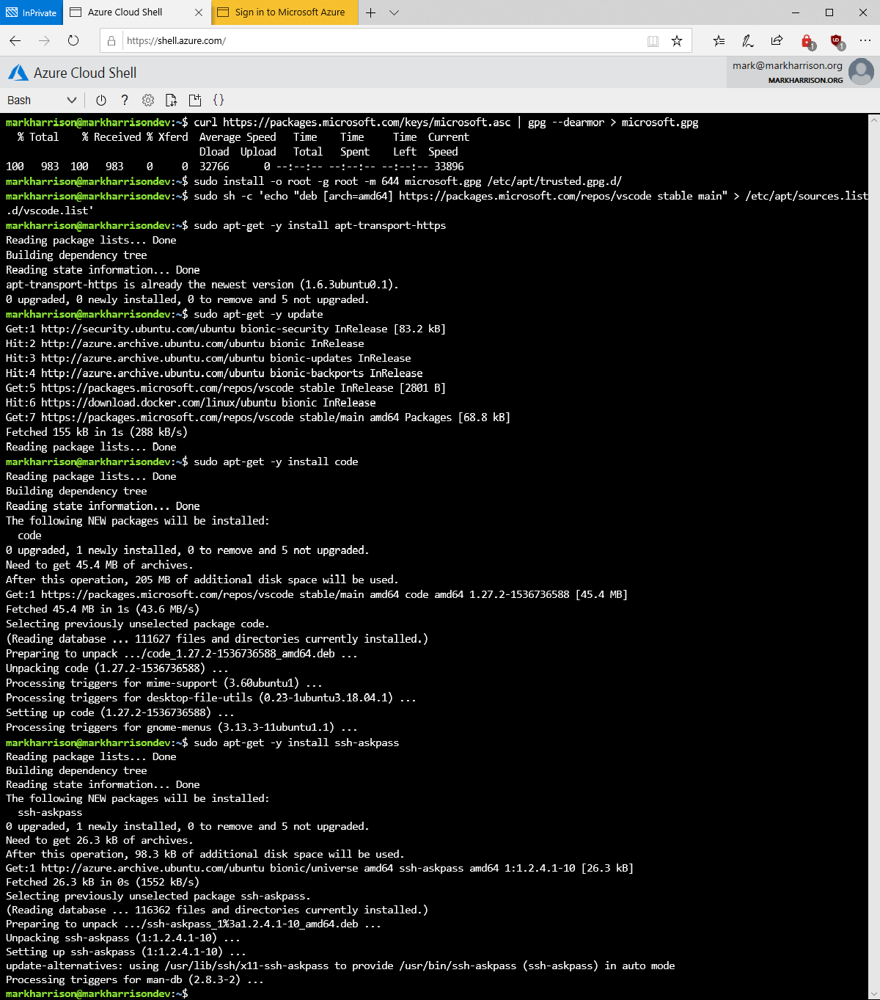

# Azure Ubuntu Dev - Setup Script

Mark Harrison : 5 Oct 2018


- [Setup Azure Ubuntu development machine](AzureUbuntuDev-1.md) ... this document

## Overview

This document shows how to create an Ubuntu based machine in Azure that is configured for development.  

Requirement was to enable development from anywhere and to be simple / enable agility.

## Prerequisites

The following scripts use Azure CLI (Command-line interface) and SSH (Secure Shell)

The Azure CLI can be downloaded from  <https://azure.microsoft.com/en-us/downloads/>
The later version of Windows 10 have SSH built into the Command Prompt.  Alternative is to use [Putty](https://putty.org/)

To login to an Azure subscription, invoke the following:

```text
az login
```

An alternative mechanism is to use the Azure Cloud Shell which provides CLI/SSH <https://shell.azure.com>


## Create Resource Group

All Azure resources must reside with an Azure resource group.

Invoke the following:

- Amend the resource group name to that required
- Amend the location to that require

```text
az group create --name dev-rg --location westeurope
az configure --defaults group=dev-rg
```


## Create VM

To get the catalog of Ubuntu 18.04 images, invoke the following:

```text
az vm image list --all --publisher Canonical --offer UbuntuServer --sku 18.04-LTS -o table
```

Invoke the following:

- Amend name to that required
- Amend image to that required (suggest use the latest)
- Amend admin username to that required

```text
az vm create --name markharrisondev \
    --image Canonical:UbuntuServer:18.04-LTS:18.04.201810030 \
    --size Standard_DS2_v2 \
    --admin-username markharrison --generate-ssh-keys
```


Note that SSH keys are generated - these are used to authenticate when we connect to the Ubuntu machine.

Open the networking security to allow RDP traffic thtough, invoke the following:

```text
az vm open-port --port 3389  --name markharrisondev
```


## DNS name

The VM will restart with random IP addresses - so set up a DNS name.  This DNS name will be used to remote desktop (RDP) onto the machine.

Get the name of the Public IP resource, invoke the following:

```text
az network public-ip list -o table
```

Set up the DNS name, invoke the following:

- Amend the name to the Public IP resource (from above)
- Amend the DNS name to that required

```text
az network public-ip update --name markharrisondevPublicIP  \
    --dns-name markharrisondev --allocation-method Static
```


The JSON returned will give the fully qualified domain name of the machine e.g.`markharrisondev.westeurope.cloudapp.azure.com`

## Connect to the machine

Use SSH to get a prompt onthe Ubuntu machine.  Authentication will use the SSH keys generated when we create the VM earlier.

Invoke the following:

- Amend the DNS name as specified above
- Amend the user name to that specified when the VM was created

```text
ssh markharrison@markharrisondev.westeurope.cloudapp.azure.com
```


## Specify user password

A user password is needed to RDP onto the desktop, invoke the following and specify a password:

```text
sudo passwd -d markharrison
passwd
```


## Install RDP / Desktop

The following will install LXDE - this is a free desktop environment with comparatively low resource requirements.  Alternative desktops could be installed.  Also the install the Remote Desktop Protocol service to enable remote access to the desktop.

```text
sudo apt-get -y update
sudo apt-get install lxde -y
sudo apt-get install xrdp -y
sudo systemctl enable xrdp
```

(this takes several minutes to install)


## Install Docker

Info taken from <https://docs.docker.com/install/linux/docker-ce/ubuntu/>

```text
sudo apt-get remove docker docker-engine docker.io
sudo apt-get install apt-transport-https ca-certificates curl software-properties-common -y
curl -fsSL https://download.docker.com/linux/ubuntu/gpg | sudo apt-key add -
sudo add-apt-repository "deb [arch=amd64] https://download.docker.com/linux/ubuntu $(lsb_release -cs) stable"
sudo apt-get -y update
sudo apt-get -y install docker-ce
sudo usermod -aG docker $USER
```

We can check Docker has installed and the version using:

```text
sudo docker version
```


The last command adds the user to the Docker group and avoids the need to use `sudo` on each docker command.  This will require a Logoff / Logon to work.

## Install Visual Studio Code

Info taken from <https://code.visualstudio.com/docs/setup/linux>

```text
curl https://packages.microsoft.com/keys/microsoft.asc | gpg --dearmor > microsoft.gpg
sudo install -o root -g root -m 644 microsoft.gpg /etc/apt/trusted.gpg.d/
sudo sh -c 'echo "deb [arch=amd64] https://packages.microsoft.com/repos/vscode stable main" > /etc/apt/sources.list.d/vscode.list'
sudo apt-get -y install apt-transport-https
sudo apt-get -y update
sudo apt-get -y install code
sudo apt-get -y install ssh-askpass
```



We can check VSCode has installed and the version using:

```text
code --version
```


## Install NodeJS

Invoke the following:

```text
sudo apt update
sudo apt -y install nodejs
sudo apt -y install npm
```

We can check Node has installed and the version using:

```text
nodejs -v
```


## Generate SSH keys

SSH keys are needed to authenticate with Git repositories like Azure Repos, Invoke the following:

- Accept all the defaults

```text
ssh-keygen -t rsa -b 4096
```

The SSH key can be viewed / extrated (to enter into Azure Respos) using:

```text
cat .ssh/id_rsa.pub
```


## Access Remote Desktop

Need a Remote Desktop Client - such as provided with Windows

Access using the fully qualified domain name as specified above.
User the credentials (username / password) as created above.

Check Visual Studio is installed - it will be in the menu system accessed from the bottom left.


### Summary

We now have a cloud environment for development - with Visual Code, Git, Docker, Node installed.  Development can be done from anywhere.

Use Git to connect to code repositories such as Github and Azure Repos, enabling source control management and team working.

Use CI/CD workflow - enabled with tools such as Azure Pipelines - to build / deploy to any staging and production environments.

Use Docker to easily pull down complex development environments that are preconfigured and ready to use e.g. Apache web server supporting PHP.  


---
<http://github.markharrison.io>
